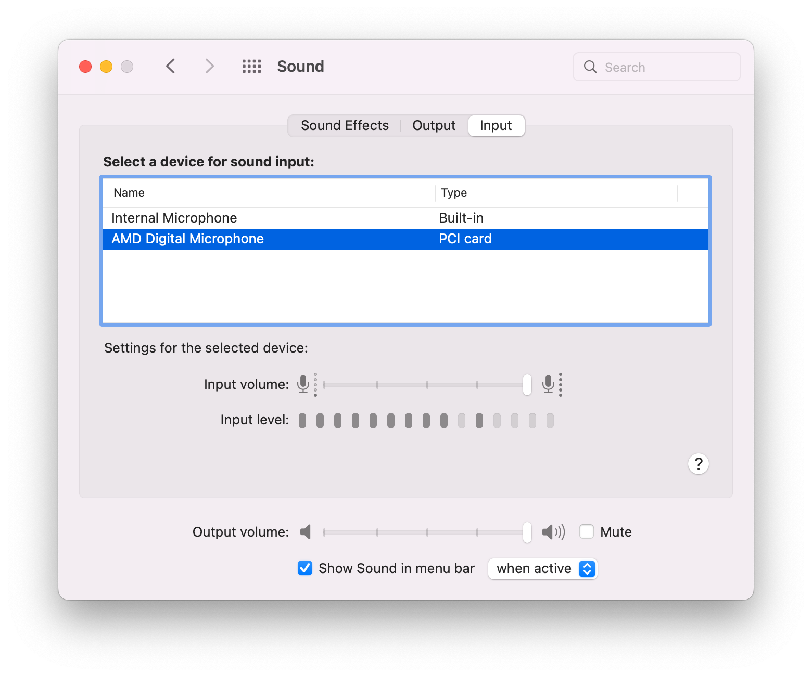
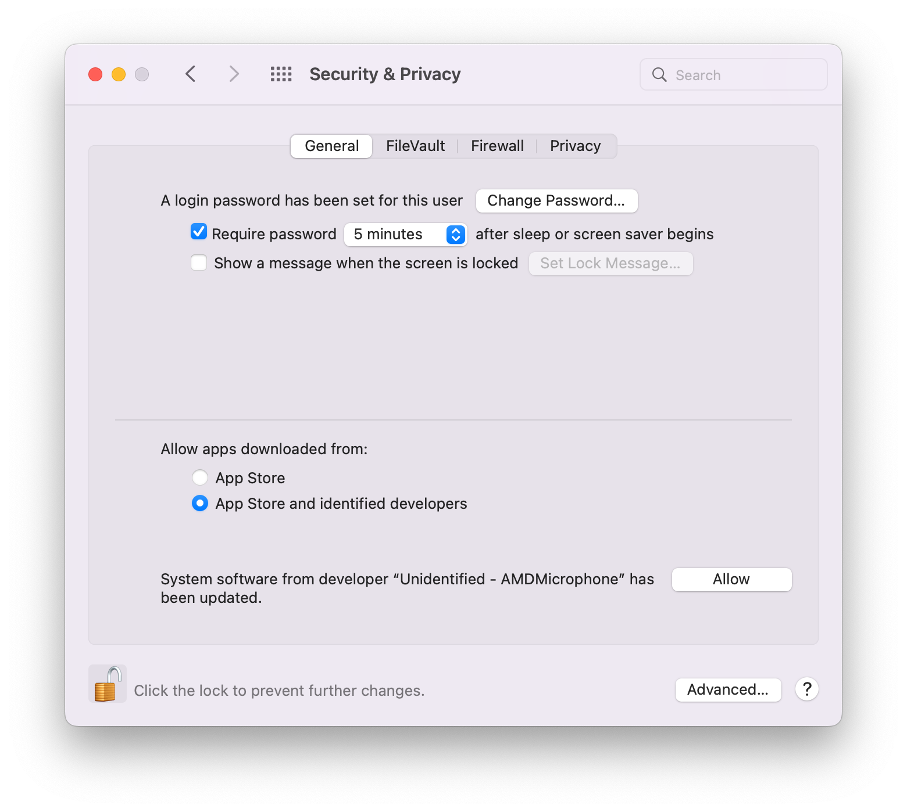

# AMD Microphone
AMD Digital Microphone kext for modern AMD laptops with AMD's Audio Co-Processor (ACP). 

<p align="center">
  
</p>

## What does this kext do?
In modern AMD laptops, microphones are no longer connected to High Definition Audio bus.
They are now controlled by a dedicated Audio Co-Processor, hence obviously no driver in macOS.
This kext brings support for them. Refer [FAQ](#faq) for more information.

## What's working?
* Microphone for Renoir-base laptops with ACP3x processor, see [this](#check-if-your-laptop-is-equipped-with-an-audio-co-processor) to identify if your laptop is supported.

## What's not working?
* Some minor noise
* Other CPU variants than Renoir, such as Raven/Raven2/Fire Flight/Van Gogh. Please open issues if you want support.

## Prerequisites 
### Disable SIP
This kext relies on `com.apple.iokit.IOAudioFamily`, which somehow is loaded very late in the boot process, so I cannot use this with OpenCore.
At the moment the only way to install this kext is to place it under `/Library/Extensions/`, which requires SIP to be disabled.
I may find a solution for this in the future.

### Check if your laptop is equipped with an Audio Co-Processor.
#### macOS
Use `ioreg -l` and find out if you have a device like this.

```console
   | |   |   +-o ACP@0,5  <class IOPCIDevice, id 0x1000001f4, registered, matched, active, busy 0 (184 ms), retain 12>
    | |   |   | | {
    | |   |   | |   "assigned-addresses" = <1005038200000000000038d00000000000000400>
    | |   |   | |   "IOInterruptSpecifiers" = (<0f00000007000000>,<0500000000000100>)
    | |   |   | |   "class-code" = <00800400>
    | |   |   | |   "IODeviceMemory" = (({"address"=3493330944,"length"=262144}))
    | |   |   | |   "IOReportLegendPublic" = Yes
    | |   |   | |   "IOPowerManagement" = {"ChildrenPowerState"=2,"CurrentPowerState"=2,"CapabilityFlags"=258,"ChildProxyPowerState"=2,"MaxPowerState"=3}
    | |   |   | |   "subsystem-vendor-id" = <721d0000>
    | |   |   | |   "built-in" = <00>
    | |   |   | |   "acpi-device" = "IOACPIPlatformDevice is not serializable"
    | |   |   | |   "pci-aspm-default" = 0
    | |   |   | |   "IOPCIMSIMode" = Yes
    | |   |   | |   "IOInterruptControllers" = ("io-apic-1","IOPCIMessagedInterruptController")
    | |   |   | |   "vendor-id" = <22100000>
    | |   |   | |   "name" = <"pci1022,15e2">
    | |   |   | |   "device-id" = <e2150000>
    | |   |   | |   "IOChildIndex" = 5
    | |   |   | |   "acpi-pmcap-offset" = 80
    | |   |   | |   "IOPCIResourced" = Yes
    | |   |   | |   "compatible" = <"pci1d72,2019","pci1022,15e2","pciclass,048000","ACP">
    | |   |   | |   "IOServiceDEXTEntitlements" = (("com.apple.developer.driverkit.transport.pci"))
    | |   |   | |   "IOPCIExpressLinkCapabilities" = 4197635
    | |   |   | |   "acpi-path" = "IOACPIPlane:/_SB/PCI0@0/GP17@80001/ACP@5"
    | |   |   | |   "subsystem-id" = <19200000>
    | |   |   | |   "revision-id" = <01000000>
    | |   |   | |   "IOPCIExpressLinkStatus" = 4355
    | |   |   | |   "IOPCIExpressCapabilities" = 2
    | |   |   | |   "pcidebug" = "3:0:5"
    | |   |   | |   "IOName" = "pci1022,15e2"
    | |   |   | |   "IOReportLegend" = ({"IOReportGroupName"="Interrupt Statistics (by index)","IOReportChannels"=((5291294645182070784,4295098369,"               $
    | |   |   | |   "reg" = <00050300000000000000000000000000000000001005030200000000000000000000000000000400>
    | |   |   | | }
```

#### Linux
Use `lspci -nn`. If you have a device like this, you're good to go.

```console
03:00.5 Multimedia controller [0480]: Advanced Micro Devices, Inc. [AMD] Raven/Raven2/FireFlight/Renoir Audio Processor [1022:15e2] (rev 01)
```

#### Windows
T.B.D

## Installation
1. Disable SIP.
2. Download the kext from Github Actions.
3. Copy it to `/Library/Extensions/`.

```console
sudo cp -r AMDMicrophone.kext /Library/Extensions/
```

4. When notified, allow it in `Security & Privacy settings` and reboot.

<p align="center">
  
</p>


## FAQ
#### I heard that AMD Microphone can work with VoodooHDA. How is this kext different?

Modern AMD laptops no longer use High Definition Audio (HDA). It has a dedicated Audio Co-Processor for controlling microphones.

#### Can I use this kext along with AppleALC?

Yes. This kext is a separate driver for microphones. You still need AppleALC for audio output.
